# Introduce

<center>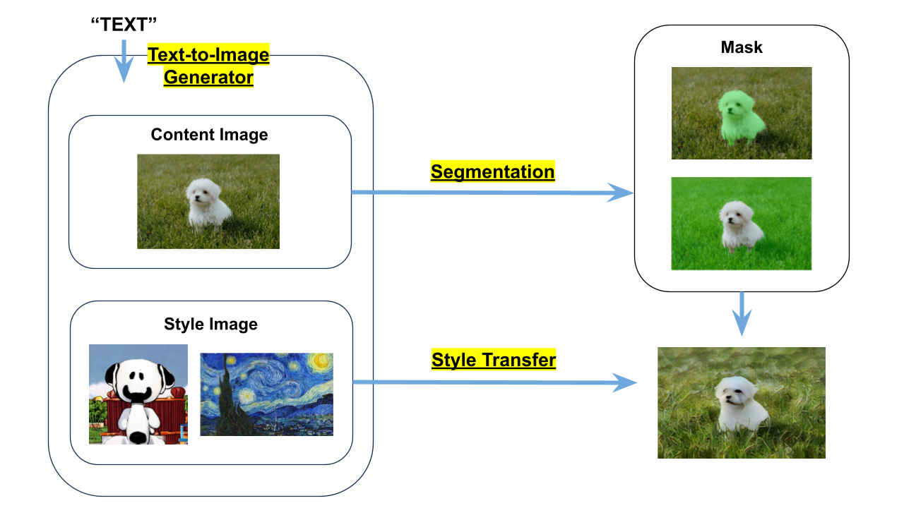</center> <br>

# Quick Start

- Colab ver : [***demo.ipynb***] (https://colab.research.google.com/drive/1z7H2DO9HZMtw-ylNCzoU0RafJKTRAeZU?usp=sharing)
- Colab+Web ver : [***demo_web.ipynb] (https://colab.research.google.com/drive/1JzZe3k9A-kHUvxVlpCXFbHOXIufeOk-F?usp=sharing)

# How to Use

### 1. `upload/url/path/create` 를 통해 스타일을 바꾸고 싶은 이미지를 선택하기

- upload <br>
    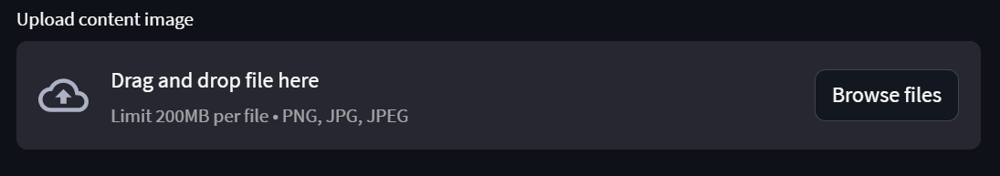

- url <br>
    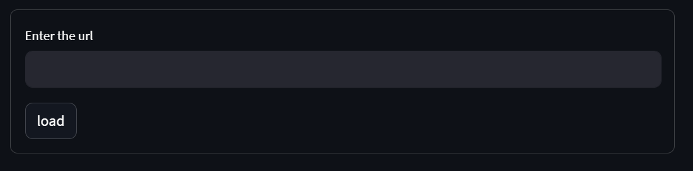

- path <br>
    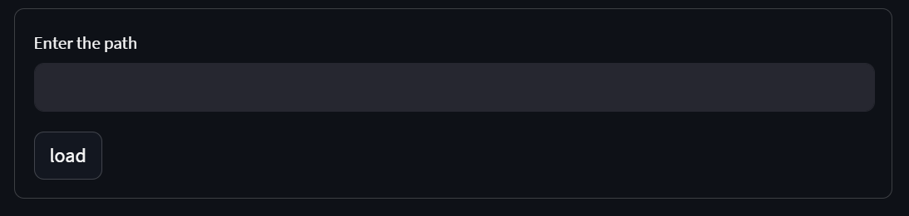

- create <br>
    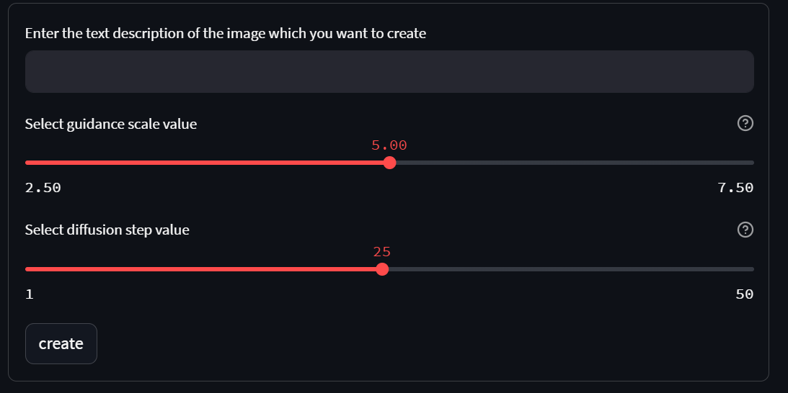 <br>

### 2. 스타일을 바꾸고 싶은 이미지에서 마스크와 스타일 이미지 쌍 생성하기

- 이미지에서 스타일을 바꾸고 싶은 부분을 클릭하여 그 부분에 대한 마스크를 생성하고 합치기 <br>
    <center>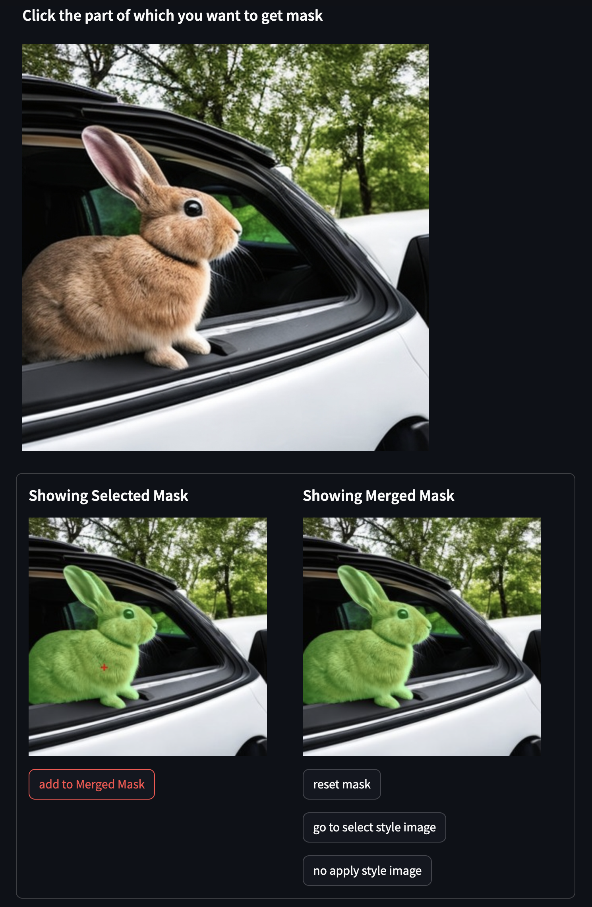</center> <br>

- 합쳐진 마스크 부분에 대해서 `go to select style image` 버튼을 눌러 스타일 이미지를 선택하기 <br>
(`no apply style image` 버튼을 누르면 합쳐진 마스크 부분에 대해서 스타일을 바꾸지 않고 원래 이미지 그대로 사용) <br>
    <center>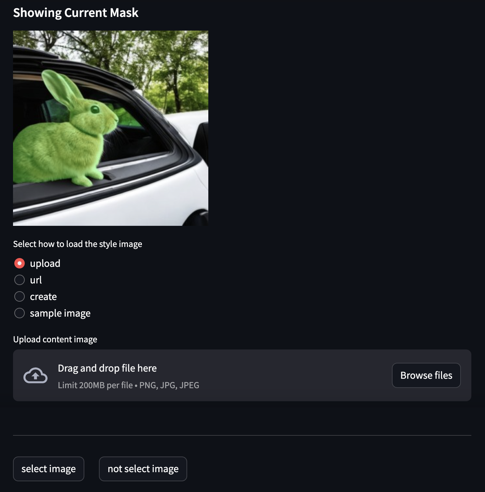</center> <br>

- 위 내용을 반복하여 자유롭게 마스크와 스타일 이미지 쌍 생성하기 <br>

- 아직 선택되지 않은 부분에 대해서 스타일 이미지를 선택하기 <br>
    <center>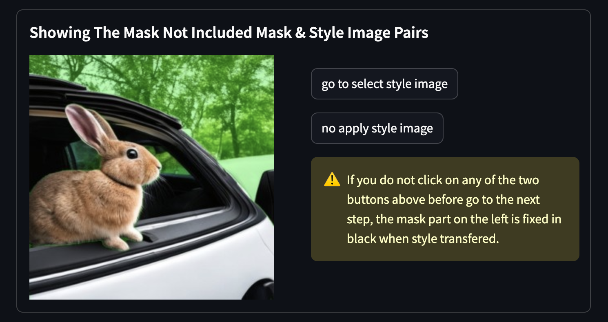</center> <br>

- `Show Pairs` 탭에서 생성된 마스크와 스타일 이미지 쌍 확인하기 <br>
    <center>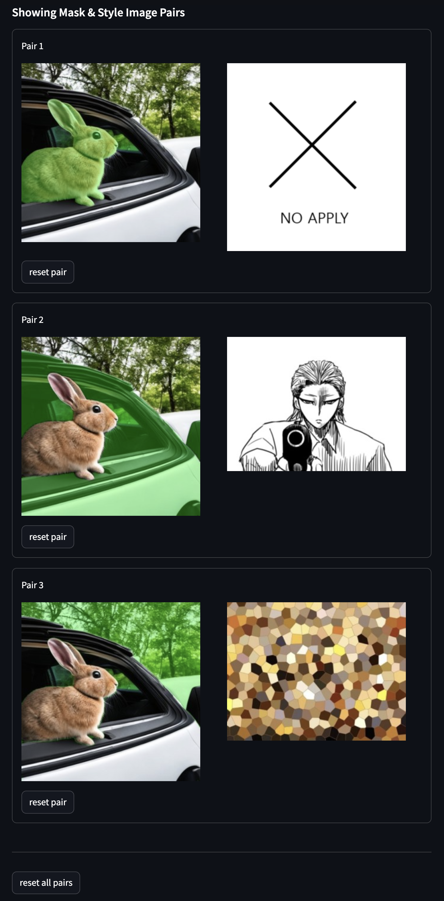</center> 

### 3. 생성된 마스크와 스타일 이미지 쌍으로 Style Transfer 적용하기

<center>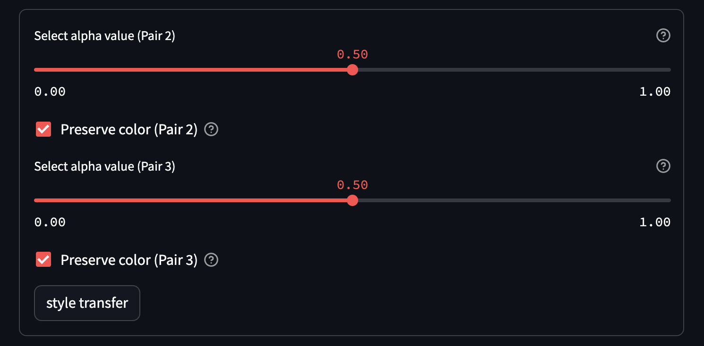</center> <br>

# Requirements

```txt
torch
numpy
Pillow
matplotlib
diffusers
transformers
scipy
ftfy
accelerate
``` 
<br>

# Model Usage

### Text-to-Image Generator

[***Stable Diffusion***](https://github.com/Stability-AI/stablediffusion) <br>
<center>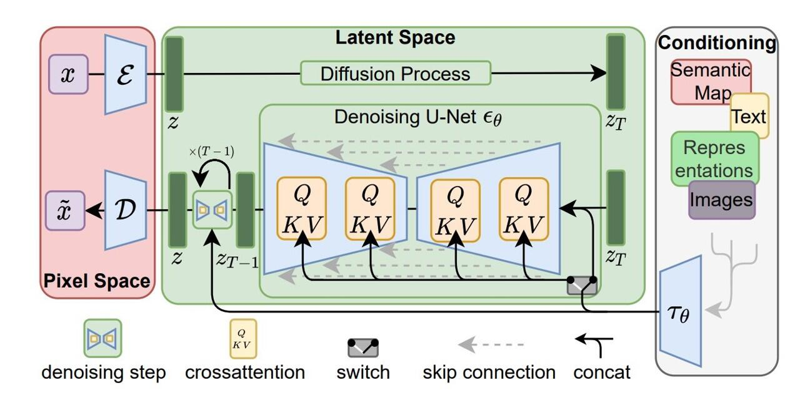</center> 

### Segmentation

[***SAM***](https://github.com/facebookresearch/segment-anything)
<center>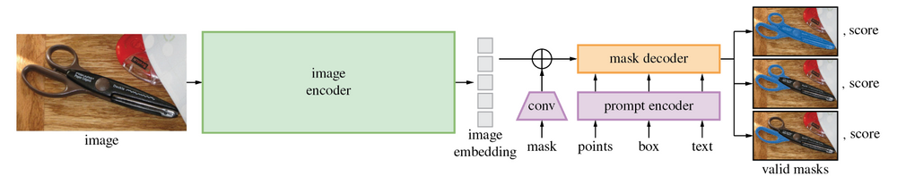</center> 

### Style Transfer

[***AdalN***](https://github.com/naoto0804/pytorch-AdaIN)
<center>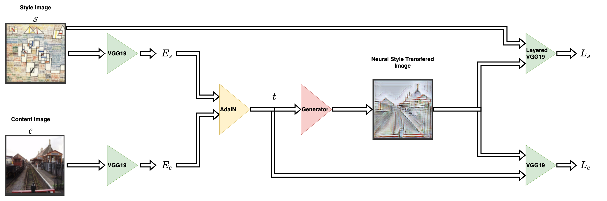</center>  <br>

# Sample Images

<p align="center">
  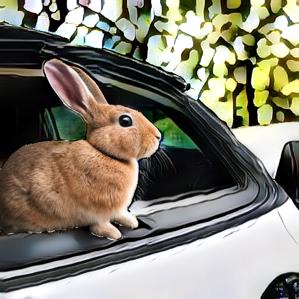
  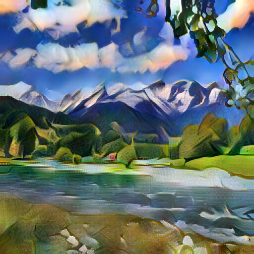
</p>
<p align="center">
  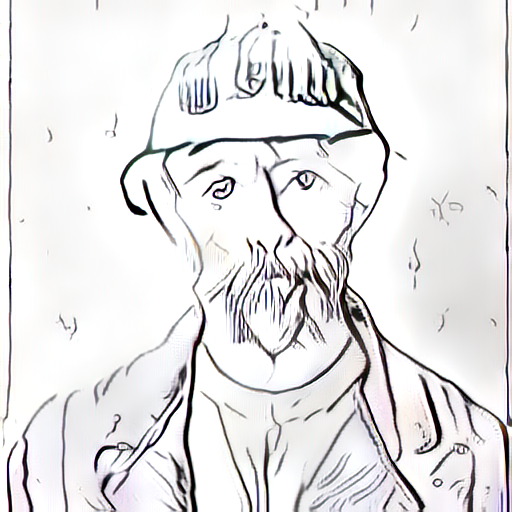
  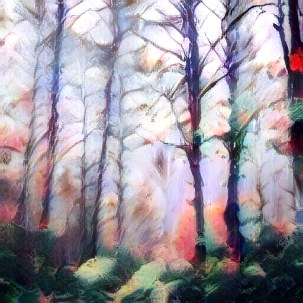
</p>

# Contributions

|     Name      |                   Kim DoHyeon                    |              Park JiWan              |               Sohn SooKyoung               |
| :-----------: | :----------------------------------------------: | :----------------------------------: | :----------------------------------------: |
| **Github ID** | [@Dohyeon-Kim1](https://github.com/Dohyeon-Kim1) | [@jiwaan](https://github.com/jiwaan) | [@sooking87](https://github.com/sooking87) |
