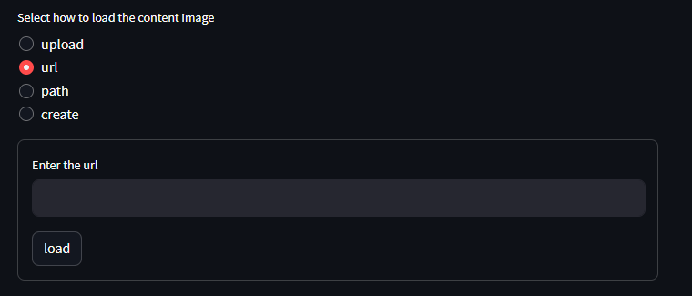
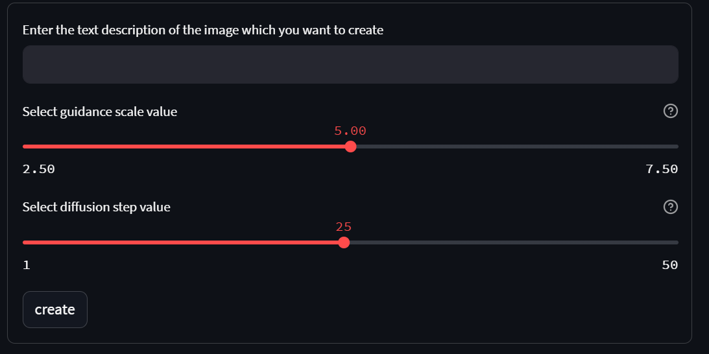
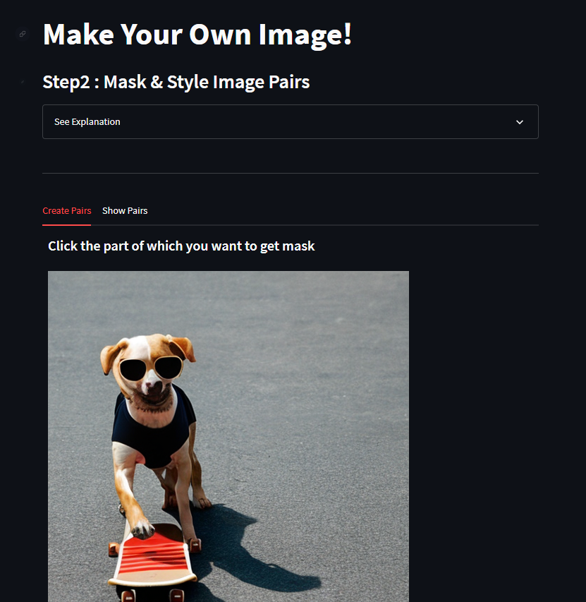
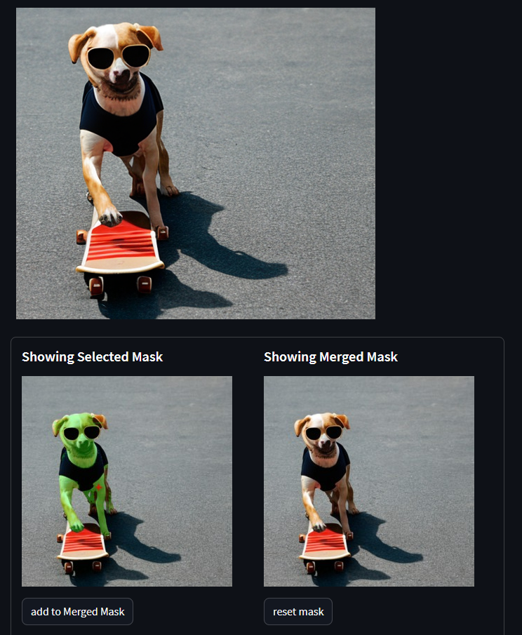
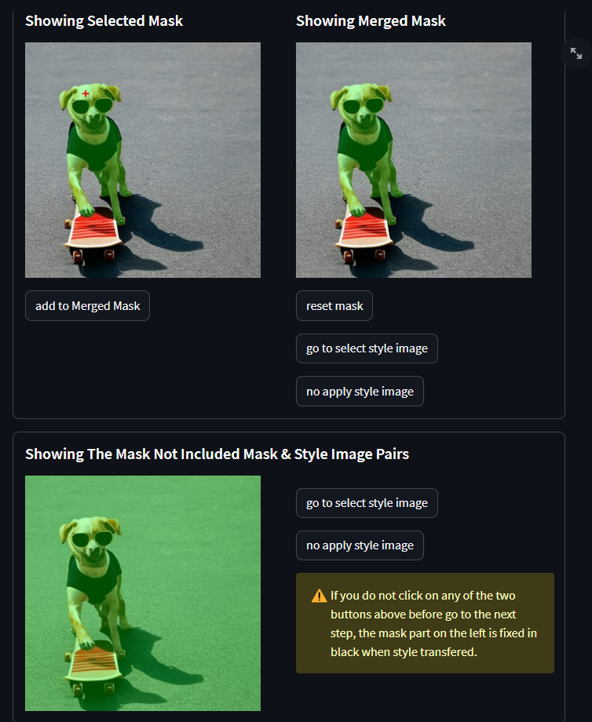
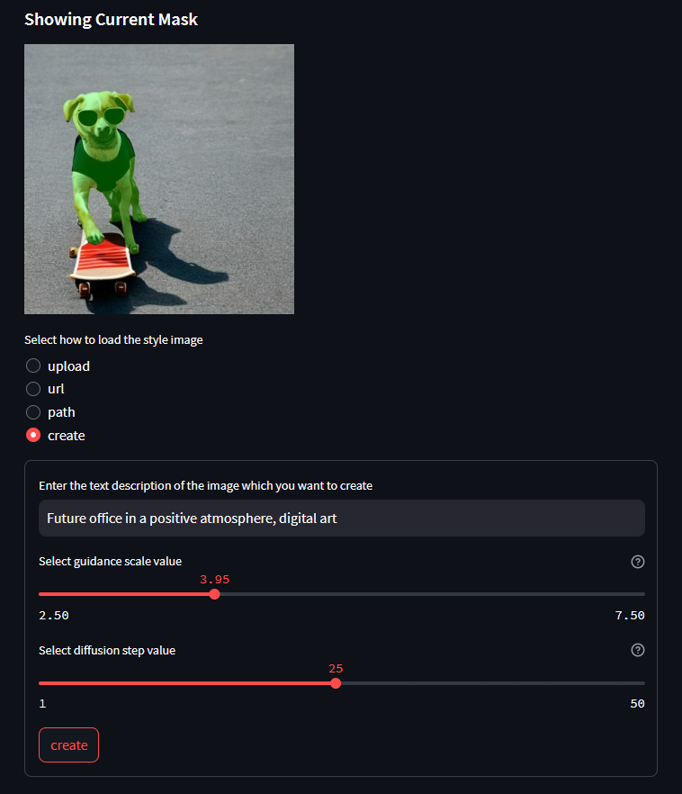
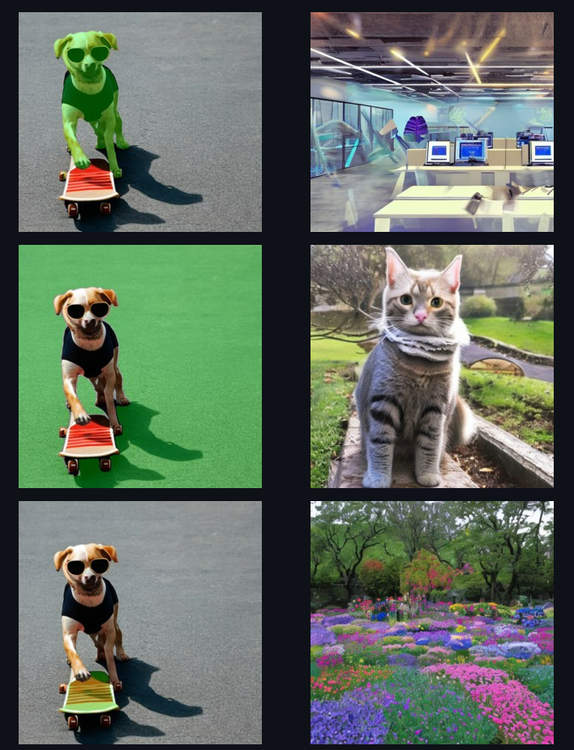
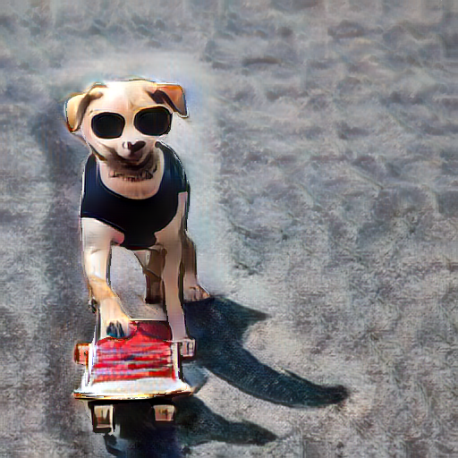

# Introduce

<center></center>

## 1. `url/path/create` 를 통해서 스타일을 바꾸고 싶은 이미지를 선택합니다.
   - url <br>
       <center></center>
   - path <br>
       <center></center>
   - create <br>
       <center></center> <br>
       - select guidance scale value: 높으면 텍스트를 강하게 적용하고, 낮으면 이미지를 더 창의적으로 만듭니다. <br>
       - select diffusion step value: 25가 적절한 시간 안에 적당한 퀄리티의 이미지를 생성합니다.
## 2. style content 불러오기 및 씌울 마스크 부분 결정

👉 click image <br>

<center></center> 
<center></center> <br>

👉 style image url/path/create <br>

<center></center> 
<center></center> <br>

👉 check pairs <br>

<center></center> <br>

## 3. 선택한 마스크에 pair style image 적용시키기
<center></center> <br>

# Requirement

```python
torch
numpy
Pillow
matplotlib
diffusers
transformers
scipy
ftfy
accelerate
```

## 사용한 모델

### Text-to-Image Generator

stable_diffusion

### Segmentation
SAM

### Style_Transfer
AdalN

# Sample Image

!! sample image 추가 해주세용 !!

<center></center> <br>

# Contributions

|     Name      |                   Kim DoHyeon                    |              Park JiWan              |               Sohn SooKyoung               |
| :-----------: | :----------------------------------------------: | :----------------------------------: | :----------------------------------------: |
| **Github ID** | [@Dohyeon-Kim1](https://github.com/Dohyeon-Kim1) | [@jiwaan](https://github.com/jiwaan) | [@sooking87](https://github.com/sooking87) |
